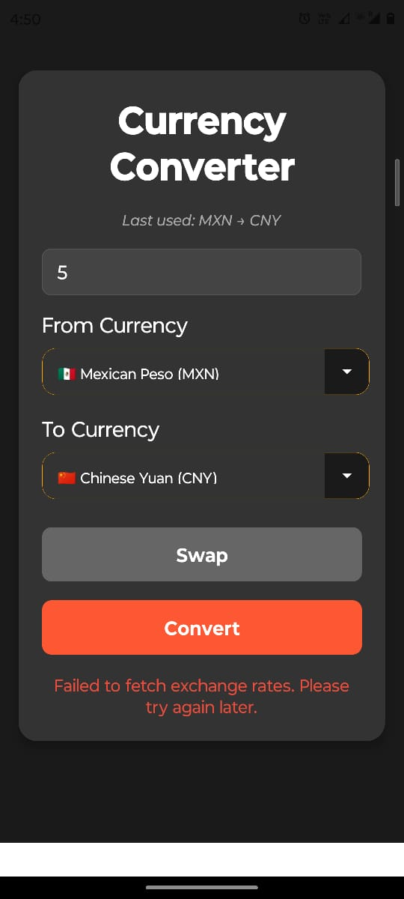

# Currency Converter App

The Currency Converter app allows users to easily convert an amount from one currency to another using real-time exchange rates. It also remembers the last used currencies and amount for the next session, providing a seamless experience.

## How to Use the App

### 1. **Launch the App**
   When you open the app, you will be presented with the following features:
   
   - **From Currency (Base Currency):** This is the currency you want to convert from. You can select the currency from a dropdown list (e.g., USD, EUR, INR, GBP, etc.).
  
   - **To Currency (Target Currency):** This is the currency you want to convert to. Similar to the base currency, you can choose from a list of available currencies.
   
   - **Amount Input:** Enter the amount you want to convert. The app will automatically update and display the converted amount once the "Convert" button is pressed.

### 2. **Select the Currencies**
   - Choose the **From Currency** (the currency you are converting from).
   - Choose the **To Currency** (the currency you are converting to).
   - You can select your currencies using the dropdowns provided.

### 3. **Enter the Amount**
   - In the **Amount** field, enter the amount you wish to convert.
   - The app will automatically update the converted amount when you press the **Convert** button.

### 4. **Press the Convert Button**
   - Once the amount is entered, press the **Convert** button to get the converted value.
   - The app will show the result with the conversion rate and the corresponding amount in the target currency.

### 5. **Swap Currencies (Optional)**
   - If you want to swap the "From Currency" and "To Currency," you can press the **Swap** button. This will reverse the currencies and allow you to convert in the opposite direction.

### 6. **View Last Used Currency Pair**
   - After performing a conversion, the app will show a **Last Used** message. This indicates the last selected currencies that were used for the conversion, so you don’t have to select them again the next time you open the app.
   - The app stores this data in your device's storage using **AsyncStorage**. This way, your preferences are saved and loaded each time you use the app.

### 7. **Error Handling**
   - If you enter an invalid amount (e.g., text or a non-numeric value), an error message will appear prompting you to enter a valid number.
   - If there is an issue fetching the exchange rate from the API, the app will notify you with an error message and suggest trying again later.

---

## Example Flow:

1. Open the app. You'll see the option to choose a currency for "From Currency" and "To Currency".
2. Select **USD** as your "From Currency" and **EUR** as your "To Currency".
3. Enter an amount, for example, 100.
4. Press the **Convert** button, and the app will display the converted amount in **EUR**.
5. If you want to swap the currencies (convert from EUR to USD), just press the **Swap** button.
6. After the conversion, the **Last Used** message will appear, showing the conversion pair (e.g., USD → EUR).
7. Next time you open the app, it will remember your last-used currencies and amount.

---

## Additional Features:
- **Persisted Data:** The app will store the last used currencies and amount, so you don't have to re-select them when you return.
- **Live Exchange Rates:** The app fetches real-time exchange rates to ensure accurate conversions.

---

## Troubleshooting:
- **Error when entering the amount**: If you receive an error message stating that the amount is invalid, make sure you have entered a valid number (e.g., no letters or special characters).
- **API failure**: If the exchange rate cannot be fetched, it might be a network issue or a problem with the API. Try again later.

---

## License:
This project is licensed under the MIT License - see the [LICENSE](LICENSE) file for details.

